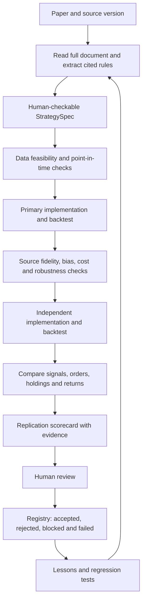

# Marginalia: verification first, paper fund later

## What we are building now

**V1: give Marginalia a research paper; receive a traceable report showing what
was implemented, what reproduced, what failed, and what remains unknown.**

Long-term destination stays AI-native fund operating through Alpaca paper
trading. First product ends at **human-reviewed research report + strategy
registry**. Portfolio construction and brokerage deployment come after V1.
Roughly one year of actual paper operation precedes any separate real-money
decision; development time does not count as paper track record.

Our advantage must be measurable research quality: faithful interpretation,
correct data, independent checks and useful failure records. Do not claim
“first autonomous fund” or “proven alpha” from a workflow diagram.

## What changed after new research

| Earlier plan | Revised plan |
| --- | --- |
| Build whole fund stack in sequence. | Finish narrow verification product before fund operations. |
| Build increasingly general custom backtester. | Evaluate mature engine first; own adapters, tests and verification layer. |
| One engine plus critic. | Primary implementation plus independent implementation and trade-level comparison. |
| Simple promising/rejected result. | Separate fidelity, replication, robustness and economic findings. |
| Papers are only idea source. | Papers first; reports, code, hypotheses and lessons later. |
| Store results for review. | Store successes, failures, assumptions and lineage so future research can improve. |
| Aim directly for paper deployment. | First prove evaluation quality on fixed benchmark; export approved candidates later. |

## Color key

🟢 Existing narrow component. 🟡 Partly built or experimental. ⚪ Still needed.
Colors describe current code, not planned integrations or proof of profitability.

## V1 pipeline

Check data availability early, before expensive code generation. Failures at any
stage also go into registry. A failed paper is useful output when failure is
correctly explained. Two engines agreeing is evidence, not proof: both could
receive wrong rules or wrong data.

## Parts required for V1

| Part | Easy explanation | Current state | Owner |
| --- | --- | --- | --- |
| Source library | Save document, URL, version, date and hash; detect duplicates. | 🟡 PDFs and experimental ingestion/database. | Vlad |
| Relevance and data pre-screen | Is there an implementable idea, and can we obtain required data? | 🟡 Template router; full screening missing. | Vlad; Shazil checks data |
| Full reader | Read equations, tables and appendices, with page references. | 🟡 Text/OCR fallbacks; current default truncates at 8,000 characters. | Vlad |
| Evidence-backed specification | Describe exact rules; distinguish quoted facts, assumptions and unknowns. | 🟡 JSON extraction and six-template schema. | Vlad |
| Fidelity checks | Verify rules and candidate behavior against source, including worked examples. | 🟡 Experimental verifier/critic; reference evaluation missing. | Vlad |
| Engine adapter | Translate verified strategy into supported primary engine without changing meaning. | 🟡 Existing templates; no LEAN integration. | Shazil; Vlad supplies candidate logic |
| Historical data | Provide correct prices, historical membership, availability timestamps and adjustments. | 🟡 Download/cache; complete point-in-time support missing. | Shazil |
| Simulation checks | Prove holdings, cash, timing, fills and costs on hand-calculated cases. | 🟡 Weight-return prototype; proper accounting validation needed. | Shazil |
| Independent comparison | Reimplement strategy separately, then compare detailed outputs. | ⚪ No integrated cross-engine verification. | Shazil |
| Robustness and bias tests | Challenge dates, costs, parameters, future-data use and multiple trials. | 🟡 Experimental pieces; main validation suite missing. | Shazil |
| Scorecard and registry | Store findings, evidence, versions and every attempt, including failures. | 🟡 Reports/artifacts exist; shared audit trail missing. | Shazil |
| Evaluation benchmark | Check whether system catches known mistakes on unseen cases. | 🟡 Core mocked tests; paper-level benchmark missing. | Both |
| Reliability | Retry/resume jobs, limit model costs, isolate candidate code, preserve artifacts. | 🟡 Graph and subprocess experiments; durable service/isolation missing. | Both in own domains |
| Team integration | Branches, CI and Shazil-controlled main merges. | 🟢 Configured; still requires sensible review. | Shazil |

Example: paper says “12-month momentum, skip latest month, hold best 10%.”
Dropping skip-month rule is fidelity failure even if resulting returns improve.
Using ETFs instead of original historical stocks is an adaptation, not exact
replication. Label it explicitly.

## What Shazil should build versus reuse

**Recommended first engine candidate: LEAN. Final selection follows short,
recorded feasibility test.** LEAN supplies backtesting infrastructure; Marginalia
owns strategy contract, data provenance, verification and comparison reports.
Open-source engine availability does not imply free data, cloud services or
agent hosting. Verify licenses, data rights, costs and local setup separately.

Before selecting engine, demonstrate: load our small dataset, run fixed strategy,
export orders/holdings/cash, reproduce results, and control execution assumptions.
Record supported capabilities and gaps. Start with daily long-only liquid US
stocks/ETFs; shortlist actual papers only after checking required data rights and
availability. Unsupported cases remain visible, not silently simplified.

For second engine, evaluate Backtrader or a small independently written reference
simulator for same limited scope. Do not build two universal engines. Existing
Marginalia engine is useful regression reference, but first fix its constant-weight
approximation before relying on it as independent accounting check. Qlib is an
optional later research/factor framework, not automatic substitute for order-level
execution comparison.

Independence has two parts:

- Separate strategy implementation from frozen specification; do not merely
  copy primary signal code into another wrapper.
- Separate accounting/execution path. Share versioned inputs and intended
  assumptions, not computed signals, positions or returns.

Keep second implementation blind to primary code/results until comparison.
Compare signals, order intent, fills, holdings, cash and returns before aggregate
metrics. Fix different calendars, cost conventions or fill assumptions first.
Predefine tolerances; never widen them after seeing failure. Separately review
source-to-spec errors because both implementations can faithfully follow bad spec.

Current engine also chooses best parameters on same period it reports.
That is exploratory optimization, not independent validation. Existing code
remains available; updating this plan does not implement or certify new engine.

## Report: separate questions, visible evidence

Start with scorecard, not opaque “87% trustworthy” score. Each row reports
**pass / fail / unknown / not applicable**, test version, evidence and reason.
Not-applicable requires written justification; unknown never counts as pass.

| Question | What report checks |
| --- | --- |
| Source fidelity | Did extracted rules and implementation follow cited text/equations? |
| Data integrity | Correct universe, delistings, corporate actions and publication timestamps? |
| Temporal integrity | Could each decision use only information available at that time? |
| Published-result replication | Same data definition, dates and assumptions; comparable paper tables/metrics? |
| Engine agreement | Do independent implementations agree within preset tolerances? |
| Robustness | Does result survive nearby parameters, subperiods and realistic costs? |
| Statistical integrity | Enough observations; uncertainty, dependence and number of tested variants considered? |
| Economic integrity | Relevant benchmark/factor exposure, turnover, spread, borrow and capacity assessed? |
| Execution fidelity | Do backtest order/fill logs match intended decisions? Paper fills checked later. |

Do not average away critical failures. Future-data access, unexplained divergence
or missing essential data blocks verification. Fidelity includes human/source
judgment; scorecard must not pretend every check can be fully automated.

Keep three separate results: **implementation fidelity**, **published replication**
and **independent economic evidence**. A faithful but unprofitable replication
can pass fidelity and fail economic assessment. Missing original data means
replication unknown; return non-replication claim only when comparison is valid.

Registry lifecycle: submitted → specified → tested → reviewed, with separate
outcomes verified / rejected / blocked / error. Record every attempt and reason.
Research verification is not approval to trade. Later paper deployment requires
Shazil's separate approval of exact version, allocation and risk limits.

## First benchmark: three cases, then twenty

1. Hand-review three papers with obtainable data. Fix specs, expected behaviors
   and comparison tolerances before runs. Add tiny accounting examples.
2. Produce complete evidence bundle for one paper in both implementations.
   Detect deliberately planted future-data and timing bugs.
3. Expand to twenty preselected papers/cases. Include replicable, ambiguous,
   data-blocked and deliberately corrupted cases; keep denominator fixed.
4. Separate development papers from hidden evaluation cases and reference code.
   Freeze prompts/settings and budget before evaluation. Do not let repair loops
   inspect hidden reference answers; reserve new cases after repeated tuning.
5. Compare Marginalia with X2Strategy and plain coding-agent baseline using same
   permitted inputs, data, model/tool budgets, retries and evaluation rules.
   Report source accuracy, false passes, missed bugs, completion, time and cost.
6. Store all results, including failures. Public benchmark is later milestone;
   publish only materials/data permitted by licenses.

Use leakage controls: record model/version and run date, separate historical
replication from later holdouts, and track all hypotheses/variants. Public paper
metrics may have been in model training; historical out-of-sample dates alone do
not eliminate model memorization. Keep hidden reference implementations separate
and eventually test forward on new data. Benchmark quality is not trading alpha.

**V1 done:** frozen 20-case benchmark runs repeatably; every case has evidence or
explicit blocker; critical seeded bugs cannot receive verified status; feasible
cases have independent comparisons; human review and full registry work. Publish
measured rates rather than promising all twenty papers replicate.

## Beyond V1: keep long-term fund vision

| Phase | Work | Owner |
| --- | --- | --- |
| V1: verification | Cited specs, data checks, two implementations, scorecard, registry. | Both |
| V2: research expansion | Scheduled discovery; reports/code/hypotheses as inputs; controlled descendants and combinations. | Vlad owns interpretation; Shazil owns evaluation/lineage |
| V3: paper fund | Export approved versions; portfolios, risk, scheduler, order lifecycle, Alpaca paper adapter, reconciliation, alerts and pause/recovery. | Shazil |
| V4: feedback | Compare expected versus actual paper behavior; diagnose errors, update research lessons and regression tests. | Shazil operates; Vlad fixes interpretation issues |
| Later decision | Review roughly one year of actual paper operation before any real-capital project. | Shazil |

Basic failure memory starts in V1. Later feedback asks whether discrepancy came
from data revisions, code, fills/costs, changing exposures or weaker signal.
Distinguish measured cause from hypothesis; record supporting evidence and next
test. Store parent strategy IDs for every mutation/combination; all descendants
count as additional research trials. Use fresh validation when lessons change
strategy. Learning produces reviewed proposals, not silent edits to deployed code.

V3 must assess how strategies interact, not just individual Sharpe. Prefer
existing broker/execution infrastructure when suitable, while verifying current
Alpaca paper support and preserving risk controls and reconciliation.

## References that informed this revision

User supplied two research notes. Selected primary sources below support design
comparisons; these are project descriptions/studies, not independently audited
profitability claims. Market-wide “first” claims and competitor performance
numbers are deliberately not part of plan.

| Reference | Practical lesson |
| --- | --- |
| [X2Strategy](https://github.com/ALAGENT-HKU/x2strategy) | Source → spec → code → backtest/diagnosis already exists; study artifact contract and benchmark against it. |
| [PolyQuant/Quantpedia replication study](https://quantpedia.com/guardrails-make-the-researcher-what-an-ai-agent-got-right-and-wrong-replicating-nine-equity-anomalies/) | Published nine-anomaly exercise emphasizes checking fidelity and interpreting failure; comparable workflow alone is no novelty claim. |
| [LEAN](https://github.com/QuantConnect/Lean) | Evaluate reusable simulation infrastructure before growing custom engine. |
| [QuantConnect agents](https://www.quantconnect.com/docs/v2/ai-assistance/agents) | Research/backtest/paper workflows already have infrastructure; distinguish hosted agents from open-source engine. |
| [Qlib](https://github.com/microsoft/qlib) | Optional later factor/model research infrastructure. |
| [KTD-Fin](https://arxiv.org/abs/2605.28359) | Evaluate memorization and sources of returns, not headline profits alone. |

Dhansetu, Otilio and AYVID in supplied notes are further architecture leads,
not verified performance baselines here. Study specific relevant components;
do not delay first reproducible case for exhaustive competitor survey.

Current source map remains in [README](../README.md). Next:
[Shazil/Vlad work plan](WORKSTREAMS.md).
