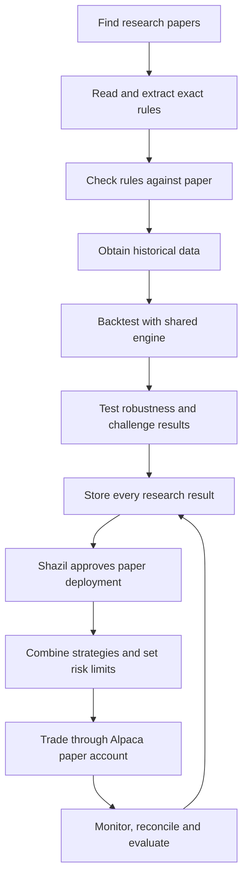

# Marginalia: complete system, explained simply

Deployment means **Alpaca paper trading**. Treat paper account as production:
real schedules, real market data, recorded decisions, monitored orders, simulated
money. Shazil decides whether approved strategies enter that account. Observe
roughly one year before separately considering real capital; no automatic switch.

## Status colors

🟢 Existing component, with narrow scope. 🟡 Started or experimental; needs work.
⚪ Still to build. Colors describe code, not proof of profitable trading.
Colored symbols render on GitHub without relying on unsupported text styles.

## Whole picture

AI helps read, explain and propose. Shared software calculates holdings, returns,
costs and limits. One agent need not exist for every box: simple scheduled jobs,
validators and databases often do those jobs better.

## 1. Research: discover ideas and describe them correctly

| Part | Plain-English job | Current state | Owner |
| --- | --- | --- | --- |
| Fund mandate | Define allowed assets, trading frequency, benchmark and risk budget. | 🟡 Investor intake exists; team mandate still needed. | Shazil |
| Discovery | Search arXiv, SSRN, NBER and journals on schedule; save new papers. | ⚪ Daily discovery and source connectors missing. | Vlad |
| Paper library | Save PDF, source URL, date, version and hash; avoid duplicate papers. | 🟡 Local PDFs; separate experiment has ingestion/SQLite. No shared service. | Vlad |
| Relevance filter | Decide whether paper provides implementable trading rules and attainable data. | 🟡 Template router exists; not full research filter. | Vlad |
| Full document reader | Read methodology, equations, tables, captions and appendices with page references. | 🟡 Text/OCR fallback exists; default extraction truncates to 8,000 characters. Full-paper fidelity unproven. | Vlad |
| Strategy extraction | Describe what to buy/sell, when, why, with what data and parameters. | 🟡 JSON extraction exists; six-template schema limits coverage. | Vlad |
| Evidence and ambiguity | Attach supporting quotes/pages to each rule; record missing details and assumptions. | 🟡 Experiment has blueprint verification; main schema lacks structured evidence. | Vlad |
| Candidate implementation | Convert verified rules into supported strategy logic. | 🟡 Templates plus older generated-code experiments. | Vlad, with Shazil's interface |
| Paper fidelity check | Compare intended behavior and worked examples against original paper. | 🟡 Experimental verifier/critic; no reliable acceptance suite. | Vlad |

Example: paper says “rank stocks by past 12-month return, skip most recent month,
hold best 10%, rebalance monthly.” Extraction must retain skip-month rule,
historical stock universe and exact timing. Replacing it with vaguely similar
momentum template changes strategy. Unsupported logic must remain unsupported
until matching implementation exists.

## 2. Backtesting: determine what historical evidence actually supports

| Part | Plain-English job | Current state | Owner |
| --- | --- | --- | --- |
| Data adapters | Retrieve prices and other required datasets through common interface. | 🟡 Price download/cache exists; broader datasets and provider checks needed. | Shazil |
| Point-in-time data | Only expose information available on each historical date. Include delistings and historical universe membership where required. | ⚪ Full support missing. | Shazil |
| Data quality | Catch gaps, stale prices, splits, bad timestamps and unavailable assets. | 🟡 Basic checks; missing symbols can currently be dropped with warning. | Shazil |
| General strategy interface | Run many kinds of rules through same engine. | 🟡 Six templates exist; extensible strategy interface needed. | Shazil |
| Accounting and simulation | Track shares, cash, fills, fees, dividends, exposures and portfolio value over time. | 🟡 Daily weight/return prototype; full holdings ledger needed. | Shazil |
| Execution assumptions | Model order timing, spread, slippage, partial fills, liquidity and borrowing where applicable. | 🟡 One-bar weight shift and linear turnover costs only. | Shazil |
| Performance report | Show return, risk, drawdown, turnover and appropriate benchmark comparisons. | 🟢 Metrics/report components exist; interpretation and coverage need expansion. | Shazil |
| Research validation | Separate replication, training, validation and untouched test periods. | ⚪ Current optimization selects best Sharpe on same history it reports. | Shazil |
| Robustness tests | Change dates, costs and nearby parameters; check multiple market conditions. | 🟡 Separate experiment has robustness code; main engine needs systematic suite. | Shazil |
| Bias and statistical checks | Detect future-data access, selection bias and lucky winners from many trials. | 🟡 Experimental critic prompts; deterministic checks and trial accounting needed. | Shazil |
| Reproducibility | Save exact data snapshot, code/spec versions, configuration and all trials. | 🟡 Outputs exist; complete immutable run records missing. | Shazil |

“General” means extensible architecture, not instant support for every asset.
Start with daily liquid US stocks/ETFs. Add shorting, intraday data, options,
futures and other assets only with their required data and accounting models.
Engine should explicitly reject unsupported features.

First accounting issue: current engine holds target weights constant between
rebalances. Actual shares produce drifting weights as prices change. Correct
cash/share accounting and cost treatment must precede confidence in results.
One-bar shifting alone also does not establish realistic execution prices.

Replication answers “did we reproduce paper?” Independent testing answers
“does evidence survive on unseen data after realistic costs?” Positive returns
alone do not establish alpha: compare against suitable market/factor exposures.

Return clear verdicts: **invalid / insufficient data / rejected / promising /
approved for paper trading**. Include reasons and uncertainty. Do not invent
precise confidence percentages or tune until historical result looks good.

## 3. Portfolio and paper trading: operate approved ideas

| Part | Plain-English job | Current state | Owner |
| --- | --- | --- | --- |
| Strategy registry | Store accepted, rejected and failed ideas with evidence and versions. | 🟡 Artifact files and experimental database; shared lifecycle missing. | Shazil |
| Human deployment decision | Review fixed strategy version, evidence and proposed allocation. | ⚪ Approval workflow needed. | Shazil |
| Portfolio construction | Combine complementary strategies; account for overlapping holdings and correlated losses. | 🟡 Ranking/basic sizing exists; multi-strategy construction missing. | Shazil |
| Risk engine | Enforce position, sector, gross/net exposure, turnover and loss limits. | 🟡 Intake/sizing helpers; account-wide enforcement missing. | Shazil |
| Signal scheduler | Compute approved signals on actual trading calendar with fresh data. | ⚪ Needed. | Shazil |
| Order management | Turn target positions into orders; prevent duplicates; handle cancels, rejects and partial fills. | ⚪ Needed. | Shazil |
| Alpaca adapter | Send orders to paper endpoint, read orders/positions, and receive updates. | ⚪ Dependency/config mentions exist; integrated adapter missing. | Shazil |
| Reconciliation | Compare local records with broker cash, positions and fills; flag differences. | ⚪ Needed. | Shazil |
| Monitoring | Track jobs, data freshness, exposures, losses, broker errors and research costs. | ⚪ Unified monitoring needed. | Shazil |
| Pause/restart controls | Pause new orders, recover safely after failure, and apply explicit position policy. | ⚪ Needed. | Shazil |
| Performance attribution | Explain which strategy contributed profit, loss and risk; compare expected versus observed behavior. | ⚪ Needed. | Shazil |
| Lifecycle review | Keep, pause, revise or retire strategies without erasing earlier results. | ⚪ Needed. | Shazil |

Approval applies to strategy version, configuration and risk budget. Routine
paper orders can then run automatically within those limits. Changed rules need
new evaluation; changing code must not silently replace deployed strategy.

## 4. Shared infrastructure: make system reliable

| Part | Plain-English job | Current state | Owner |
| --- | --- | --- | --- |
| Common contracts | Agree on input/output schemas between extraction, engine and registry. | 🟡 Existing StrategySpec; richer versioned contract needed. | Both |
| Orchestration | Schedule jobs, retry failures, resume progress and record state. | 🟡 LangGraph flow exists; durable scheduling/queues missing. | Both in own domains |
| Agent evaluations | Compare extracted rules with manually checked papers; measure mistakes and cost. | 🟡 Mocked tests exist; paper-level benchmark missing. | Vlad |
| Isolation and secrets | Run candidate code in restricted environment; keep broker credentials outside it. | 🟡 Experimental scans/subprocesses; strong isolation missing. | Shazil |
| Storage and audit | Preserve papers, evidence, code, data versions, approvals and order history. | 🟡 Separate files; shared storage and backup policy needed. | Shazil; Vlad supplies research records |
| Team workflow | Separate branches, automated tests, reviewed integration and clear ownership. | 🟡 Being established with this roadmap. | Shazil |
| Operator view | Show pipeline progress, rejected ideas, approvals, account health and results. | 🟡 Static demo/intake prototypes; actual operator dashboard missing. | Shazil later |

Sentiment collection/FinBERT is 🟡 existing optional research work. Add it only
when strategy needs it, with historically timestamped data. Today's sentiment
cannot be inserted into historical backtest.

## Start here, in order

1. Agree on daily stocks/ETFs as first supported market and write shared handoff
   contract. Pick three simple papers and manually verify their rules together.
2. Work in parallel: Vlad produces evidence-backed strategies; Shazil proves
   engine accounting on tiny datasets where correct answer is known by hand.
3. Connect one paper end to end. Store all assumptions, data gaps and results.
   Replicate original rule before attempting parameter improvements.
4. Add untouched test periods, robustness tests, costs and explicit rejection
   reasons. Verify future observations cannot change earlier decisions.
5. Add registry, portfolio limits, approval and Alpaca paper adapter. Verify
   duplicate prevention, rejected orders, partial fills and restart recovery.
6. Run one approved strategy with small simulated allocation. Reconcile daily,
   then add strategies gradually. Automate discovery after handoff works.
7. Keep monthly and annual reviews. Record deployments, pauses, changes and all
   failed strategies. Evaluate around one year of actual operation.

Paper trading is operational target, but simulator fills still differ from real
markets. Year-end review should consider those differences alongside profit,
drawdown, costs, trade count and system reliability. Real-capital setup and any
fund legal/operational requirements belong to separate future project.
See [Alpaca paper-trading documentation](https://docs.alpaca.markets/docs/paper-trading).

## Where current work lives

- `marginalia/`: current deterministic engine, API, graph, extraction and sizing.
- `tests/`, `examples/`: current tests and example strategy.
- `agents/strategy_extraction/`: original PDF/codegen prototype and source papers.
- `experiments/quantbros/`: preserved separate blueprint/critic/codegen research;
  not integrated or certified as current engine.
- `agents/sentiment/`, `frontend/`, `web/`: optional modules and UI prototypes.

Next: [two-person work plan](WORKSTREAMS.md).
