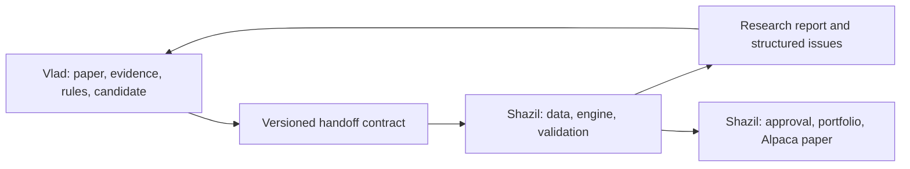

# Shazil + Vlad: two parallel workstreams

Target: reliable research system ending in **Alpaca paper trading**. Paper account
is production for now. No real-money deployment in this plan.

🟢 Existing narrow component. 🟡 Foundation/experiment. ⚪ Needs building.
Status is starting point, not task completion claim.

## Ownership

| Vlad: research to strategy | Shazil: strategy to paper account |
| --- | --- |
| Find papers and judge relevance. ⚪ | Define first supported market and engine capabilities. 🟡 |
| Read full PDFs, equations, tables and appendices. 🟡 | Acquire and validate point-in-time market data. 🟡 |
| Extract exact rules with source evidence. 🟡 | Build extensible, deterministic backtest engine. 🟡 |
| Record assumptions and missing information. 🟡 | Prove accounting, timing and transaction costs. 🟡 |
| Produce candidate strategy logic in shared interface. 🟡 | Test out-of-sample performance and robustness. ⚪ |
| Check candidate matches paper; fix extraction errors. 🟡 | Store experiments and evaluate paper-deployment candidates. 🟡 |
| Build extraction benchmarks and recurring discovery. ⚪ | Build portfolios, risk controls, Alpaca orders and monitoring. ⚪ |

Vlad owns difficult interpretation stage, including paper fidelity. His work
ends with verified strategy package and responses to fidelity questions.
Shazil owns engine correctness, performance judgment, portfolio and trading.
Neither person silently fills gaps in other's contract.

## How work joins together



Vlad can work with mock engine responses. Shazil can work with manually authored
strategy fixtures. Neither needs to wait for other's complete system.

## First shared deliverable: handoff contract

Existing `marginalia/engine/spec.py` is useful starting point, but six-template
schema is not complete general contract. Agree on version 1 before splitting.
Table below is proposed contract, not claim of implemented schema.

| Vlad supplies | Why Shazil needs it |
| --- | --- |
| Schema version, strategy ID and revision | Know exactly which definition is being tested. |
| Paper URL/identifier, PDF hash and publication/version dates | Reproduce source and distinguish post-publication tests. |
| Pages, quotes and equations supporting each rule | Check rules came from paper. |
| Universe selection as of each date | Avoid using today's survivors for old tests. |
| Required data fields, frequency, units and availability delay | Know what data engine must provide and when it becomes usable. |
| Signal calculation, entry/exit rules and parameter meanings | Implement exact intended behavior. |
| Signal timestamp, execution timing, order intent and rebalance rule | Prevent ambiguous or impossible trades. |
| Position-sizing intent and constraints | Separate paper's rule from fund's final allocation. |
| Paper's original parameters versus research variants | Keep replication separate from optimization. |
| Missing details, explicit assumptions, unsupported capabilities | Fail clearly instead of inventing convenient defaults. |
| Small worked examples with expected decisions | Test fidelity without relying on profitable backtest. |
| Candidate implementation reference/hash, if needed | Review exact code executed. |

Shazil returns run ID, spec/code/data versions, data gaps, execution assumptions,
replication report, independent test results, costs, warnings and verdict.
Failures use clear categories: `invalid_spec`, `missing_data`,
`unsupported_capability`, `implementation_mismatch`, `failed_validation`.

Boundary rule: strategy computes signals/target positions using available data;
shared engine owns fills, holdings, cash, costs and performance calculations.
Generated code does not supply authoritative P&L or access broker credentials.
Retain paper evidence even when candidate cannot run yet.

## Parallel delivery plan

Phases are acceptance gates, not calendar promises.

| Phase | Vlad builds | Shazil builds | Done when |
| --- | --- | --- | --- |
| 0: agree | Three manually annotated example papers; required fields. | Capability list; proposed interface; hand-authored fixtures. | Both accept contract and golden examples. |
| 1: core | Full document extraction with citations and ambiguities. | Holdings/cash ledger, calendar, fills and cost tests. | Vlad's rules match examples; Shazil's numbers match hand calculations. |
| 2: connect | Emit validated packages; candidate plugins where needed. | Contract adapter, data snapshots, common runner, run records. | One paper runs reproducibly; unsupported rules fail explicitly. |
| 3: challenge | Paper-fidelity checker and extraction accuracy benchmark. | Independent holdout, walk-forward, bias and sensitivity tests. | Known bad strategies fail for expected reasons. |
| 4: scale | Discovery, deduplication, relevance ranking and retry/resume. | Registry, portfolio construction, allocation/risk policy. | New papers enter same pipeline; rejected runs remain visible. |
| 5: deploy | Maintain research quality; answer implementation questions. | Approval workflow, Alpaca paper adapter, order lifecycle, reconciliation. | One approved version runs and recovers without duplicate orders. |
| 6: operate | Expand paper coverage and fix measured extraction errors. | Dashboard, alerts, attribution, monthly review and retirement policy. | Account monitored daily; research and trading history reproducible. |

## Shazil's engine priorities

1. Fix/replace constant-weight accounting with explicit shares and cash. Test
   drifting weights, entries/exits, dividends, splits, missing bars and fees.
2. Make information timing and fill prices explicit. A one-day shift alone is
   not enough. Reject missing required data instead of silently dropping assets.
3. Separate strategy interface from six-template catalog. Add capabilities
   incrementally; document unsupported asset types and order behavior.
4. Keep replication parameters fixed. Separate optimization from untouched
   evaluation; record every trial, including failures and rejected variants.
5. Compare benchmarks and risk exposures; stress dates, costs and nearby
   parameters. Measure uncertainty, not just highest Sharpe.
6. Reuse same strategy definition for historical replay and scheduled paper
   signals. Change data/execution adapters, not strategy interpretation.

## Vlad's extraction priorities

1. Handle full document rather than first 8,000 characters. Preserve page/table
   references and equations; report unreadable content.
2. Distinguish explicitly stated rules from inferred implementation choices.
   Missing details should block or require recorded assumption.
3. Do not force unfamiliar strategy into nearest template. Request new engine
   capability or produce reviewed candidate through shared interface.
4. Check worked examples against paper, not against attractive backtest metrics.
   Repair fidelity errors; do not rewrite rules to chase returns.
5. Benchmark extraction on manually reviewed papers before increasing discovery
   volume. Track rule errors, unsupported papers, failures, latency and cost.

## First work sessions

**Together:** pick benchmark and first three papers; agree v1 fields, timestamps,
missing-data behavior, and golden input/output examples.

**Vlad:** start from `marginalia/agents/`, `marginalia/ingest/`, original
`agents/strategy_extraction/` and preserved `experiments/quantbros/` prompts.
Deliver one complete strategy package before building daily discovery.

**Shazil:** start from `marginalia/engine/`, `marginalia/data/`, and `tests/`.
Prove accounting on tiny datasets, then implement contract adapter. Portfolio
and Alpaca work follows engine validation.

**First integration demo:** paper → cited rules → fixed strategy → reproducible
backtest → validation report. No claim of alpha required for demo to pass.

## Branches and merge workflow

- `main`: shared tested baseline. Shazil (`@Shazil10`) controls merges.
- `Shazil`: Shazil's working branch, exact capitalization.
- `Vlad`: Vlad's working branch, exact capitalization.
- Pull requests target `main`; tests must pass before merge. Shazil reviews
  Vlad's PRs and merges both streams. Review interface changes together.
- Code ownership assigns `@Shazil10`; GitHub rules enforce main restrictions.
  Branch name alone does not grant access or force collaborator to use it.
- Main update rule permits only `@Shazil10`, through pull requests. Separate
  quality rule requires passing `core-tests`, resolved review threads, and no
  force-push/deletion. No extra approval is required for Shazil's own PR because
  authors cannot approve their own changes; only Shazil can perform merge.
  Rule definitions live in `.github/rulesets/`; editing JSON alone does not
  update GitHub settings. Repository owner can change settings.
- Vlad needs repository access under his actual GitHub username. Creating
  `Vlad` branch does not invite him. Only Shazil was listed as collaborator
  when this plan was prepared.

Start Shazil work:

```bash
git fetch origin
git switch Shazil
git merge origin/main
```

Start Vlad work from fresh clone:

```bash
git fetch origin
git switch --track origin/Vlad
git merge origin/main
```

If local `Vlad` branch already exists, use `git switch Vlad`. Before pushing,
commit changes on own branch, then `git push`. Avoid force-pushing shared
history. After each main merge, bring `origin/main` into both work branches.

## What to defer

Real capital, investor onboarding, complex asset classes and polished marketing
UI can wait. Existing sentiment prototype is optional. First milestone is one
correctly interpreted strategy running through trustworthy backtest and then
approved Alpaca paper deployment with daily reconciliation.
