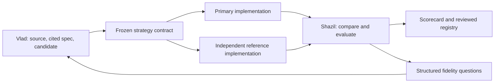

# Shazil + Vlad: parallel plan for verification V1

## Shared target

**First release: paper → cited strategy → independently checked backtests →
clear report → human-reviewed registry.**

Alpaca paper fund stays later destination. Vlad owns interpretation. Shazil owns
backtesting reliability and evaluation, then portfolio/trading. Strong engine
work now means owning correct adapters and tests around reusable infrastructure,
not necessarily writing every simulator from scratch.

🟢 Existing narrow component. 🟡 Started/experimental. ⚪ Needed.
See [system guide](AI_NATIVE_HEDGE_FUND.md) for full scope and status.

## Two workstreams

| Vlad: understand and implement research faithfully | Shazil: independently test and judge evidence |
| --- | --- |
| 🟡 Read PDFs, tables, equations and appendices with source locations. | 🟡 Evaluate LEAN primary adapter and independent second engine. |
| 🟡 Extract rules, parameters and data needs without silent substitutions. | 🟡 Supply point-in-time datasets and explicit execution assumptions. |
| 🟡 Record facts, assumptions, missing details and worked examples. | 🟡 Validate cash/holdings accounting, timing, fills and costs. |
| 🟡 Produce candidate signal/strategy logic through agreed interface. | ⚪ Build independently implemented reference and trade-level comparison. |
| 🟡 Verify candidate against original source; fix fidelity errors. | 🟡 Build bias, robustness, statistics and economic checks. |
| ⚪ Evaluate extraction accuracy and abstention on fixed paper set. | 🟡 Build scorecard, reproducible run records and registry. |
| ⚪ Later: automate discovery and broaden research inputs. | ⚪ Later: portfolio, risk, Alpaca paper operations and feedback. |

Vlad is not responsible for brokerage, portfolio or engine accounting. Shazil
does not silently reinterpret paper to make it run. Shared decisions: first
supported market, handoff fields, benchmark cases and acceptance rules.

## How to work without waiting for each other

Vlad starts with papers and mock engine responses. Shazil starts with manually
written specs and tiny known-answer datasets. Join at versioned handoff contract.



Reference implementation sees frozen specification and source, but not primary
code or results until it is complete. Vlad's source review remains necessary:
two engines can agree on incorrectly extracted rule.

## Handoff: what each person delivers

| Vlad supplies | Shazil uses it for |
| --- | --- |
| Schema version, strategy ID/revision and parent IDs | Track exact strategy and every later variant. |
| Source URL, document hash, version/publication date | Reproduce input and distinguish time periods. |
| Source quote/page/equation for each rule | Review fidelity. |
| Universe definition and selection time | Avoid today's survivors in historical tests. |
| Data fields, units, frequency and availability delay | Check feasibility and temporal integrity. |
| Signal formula, entry/exit, rebalance and position intent | Implement exact behavior. |
| Signal timestamp and execution rule | Resolve which price/order is actually possible. |
| Fixed paper parameters and separately labeled variants | Separate replication from research optimization. |
| Assumptions, unknowns and unsupported requirements | Block, clarify or label adaptation explicitly. |
| Worked examples and expected decisions | Validate interpretation without chasing returns. |
| Paper-reported results with dates/definitions | Compare replication on like-for-like basis. |
| Candidate code hash, when generated | Identify exact primary implementation. |

Existing `StrategySpec` is starting point, not finished general contract.
Extend through explicit versioned migration; preserve raw extraction before
normalization. Do not silently drop unknown fields or insert undocumented defaults.

**Shazil returns:** run ID; spec/code/data/engine versions; actual timing/cost
assumptions; signals/orders/fills/holdings; comparable metrics; scorecard;
divergences; errors; human-review outcome. Every finding links to source,
code or log evidence.

Data/code blockers use explicit categories: invalid spec, missing data,
unsupported capability, source ambiguity, implementation mismatch, engine
divergence, failed validation. No one converts unknown to pass.

**Boundary:** strategy proposes signals/positions; engine calculates cash, fills,
fees and returns. Generated code never supplies authoritative accounting and
never receives broker credentials. Use restricted execution, runtime budgets
and immutable artifacts.

## Phases and acceptance gates

These are deliverables, not guaranteed weekly timelines.

| Phase | Vlad | Shazil | Gate |
| --- | --- | --- | --- |
| 0: scope | Annotate three candidate papers; inspect X2Strategy contract/pitfalls. | Test LEAN setup, custom-data input and log export; assess second engine. | Freeze first market, data access, schemas, assumptions and budget. |
| 1: known answers | Deliver full cited spec and worked examples for first paper. | Prove accounting/timing on hand-calculated cases; adapt spec to engine. | Rules and numbers independently reviewable; unsupported cases fail clearly. |
| 2: one complete case | Source-check primary candidate; explain ambiguities. | Build independent reference; compare trades/holdings and produce report. | One reproducible evidence bundle with no unexplained divergence. |
| 3: challenge | Add extraction mistakes and ambiguous/blocked examples. | Add future-data, universe, accounting and cost bugs; independent holdout tests. | Known critical bugs block verification; false passes measured. |
| 4: twenty-case V1 | Freeze corpus, source annotations and hidden reference cases. | Run reproducible benchmark, baseline comparisons, scorecard and registry. | Every case accounted for; all feasible cases cross-checked; review works. |
| After V1 | Discovery, new source formats and controlled research proposals. | Portfolio/risk/export, Alpaca paper deployment, reconciliation and feedback. | Separate deployment acceptance before any paper orders. |

At phase 4, success means correctly verifying, rejecting or identifying blockers.
It does not require twenty profitable strategies. A modest known-good benchmark
is better starting scope than claiming immediate support for all papers.

## Shazil's first tasks

1. **Run short engine feasibility study.** Start with LEAN. Load tiny local data,
   execute fixed rule, export complete ledger, rerun identically. Check license,
   installation, data costs and supported capabilities before committing.
2. **Choose bounded second implementation.** Evaluate Backtrader or independently
   written minimal daily reference. Document independent parts and shared inputs.
   Existing custom engine needs accounting correction before serving this role.
3. **Own correctness tests.** Check price-driven weight drift, shares/cash, fees,
   splits/dividends, missing assets, warmup, timestamps and order/fill timing.
   Prefer engine/adaptor fixes over rebuilding entire simulator.
4. **Own validation.** Freeze replication parameters; reserve untouched tests;
   account for all variants; check costs, benchmarks/exposures and uncertainty.
   Predeclare comparison tolerances and critical blockers.
5. **Own run/report contract.** Save logs, data hashes, model/prompt versions,
   retries, engine versions, assumptions and failures. Separate verification from
   economic promise and later deployment approval.
6. **Own reuse decision.** Keep current engine/tests as reference. Retire duplicate
   execution paths only after replacement passes relevant acceptance fixtures.

## Vlad's first tasks

1. **Read one complete paper well.** Preserve equations, tables, appendix and
   page references; explicitly mark unreadable or missing sections.
2. **Separate evidence from assumptions.** No invented parameters or proxy
   universe labeled as original replication.
3. **Study X2Strategy before redesigning parser.** Reuse compatible patterns or
   components after checking license and tests; keep Marginalia contract stable.
   Dependency adoption is separate from this documentation update.
4. **Produce candidate logic and fidelity examples.** Match frozen spec and
   Shazil's interface; request new capability rather than force nearest template.
5. **Build extraction evaluation.** Check missing rules, wrong formulas,
   citations, ambiguity handling, abstention, time and cost. Hold back evaluation
   cases/reference answers from agent tuning.
6. **Respond to source questions.** Repair source/implementation mistakes, not
   rules merely because backtest is unattractive.

## First work sessions

**Session 1 together:** pick daily long-only stocks/ETFs as initial capability;
review three candidate papers and attainable datasets; agree scope and budgets.
Papers requiring unavailable datasets stay logged as blocked.

**Vlad next:** manually annotate first spec and expected decisions. Start from
`marginalia/agents/`, `marginalia/ingest/` and preserved extraction experiments.

**Shazil next:** run LEAN feasibility fixture and define canonical output ledger.
Start from `marginalia/engine/`, `marginalia/data/` and `tests/` as reference.

**Next joint checkpoint:** compare one paper's independent implementations.
Resolve semantic discrepancies before performance ranking. Choose twenty-case
corpus only after this path works; freeze evaluation split before tuning on it.

## Benchmark and research memory rules

- Same source/data access, model settings, tool budget and retry limits for
  Marginalia, X2Strategy and plain coding-agent comparisons where supported.
  Report capability differences and exact versions.
- Track every selected case and attempt: no removal of awkward papers from
  denominator. Include data-blocked and intentionally corrupted cases.
- Score dimensions separately. Critical temporal/data/fidelity failures prevent
  verified status; high returns cannot compensate.
- Preserve hidden reference implementations. Public paper knowledge may exist in
  model training; do not describe ordinary date split as complete leakage control.
- Add each confirmed failure as regression test or retrieval note, with evidence,
  affected versions and status. Unconfirmed explanations remain hypotheses.
- Later mutations/combinations retain parents and count as new trials. Fresh
  testing and human review precede any changed deployment.
- Larger public benchmark is follow-on milestone, subject to data/source rights.
  First goal is repeatable internal evaluation with honest measured failure rates.

## Branches and merge workflow

- `main`: reviewed baseline; only Shazil (`@Shazil10`) merges.
- `Shazil` and `Vlad`: personal working branches. Focused task branches can
  isolate work when personal checkout contains unrelated changes.
- PRs into main require passing `core-tests` and resolved review threads.
  Main disallows direct updates, force-push and deletion under current rules.
- Shazil has explicit user bypass for merge restriction, through PRs only.
  In GitHub CLI he may need `gh pr merge --admin` after checks pass; separate
  quality rules have no bypass. He reviews Vlad's changes and merges both streams.
- Rules live in GitHub settings; JSON under `.github/rulesets/` records policy.
  Editing JSON alone does not update GitHub enforcement.
- Branch creation does not invite collaborator or force which branch they use.
  Vlad needs access under his actual GitHub username.

On clean working checkout:

```bash
git fetch origin
git switch Shazil
git merge origin/main
```

Vlad substitutes `git switch Vlad`, or `git switch --track origin/Vlad` on first
checkout. Resolve/commit own unrelated work before syncing; never blindly stage
everything. Push own branch and open PR. Keep shared contract changes small.

## Explicitly deferred

V1 does not build portfolio optimization, brokerage orders, paper-account
monitoring or live operations. Those stay Shazil's later responsibilities.
Also defer real capital, broad asset coverage, daily discovery at scale,
polished UI and automatic strategy mutation. Add them after verification gate,
using proven infrastructure wherever appropriate.
